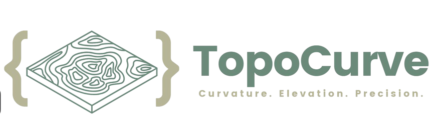

# TopoCurve
TopoCurve is a Python library for processing digital elevation models (DEM) stored in GeoTIFF format. This library provides functionalities to extract metadata, calculate principal curvatures and curvature features, as well as plot elevation values. It also includes spectral filtering capabilities for advanced DEM processing.

## Installation via pip install
To install TopoCurve, simply pip install:

```
pip install topocurve
```

## Installation via Git

To install TopoCurve, simply clone the repository and install the dependencies listed in `requirements.txt`:

```
git clone https://github.com/username/topo_curve.git
cd topo_curve
pip install -r requirements.txt
```

## Usage & Example from pip install

```
!pip install topocurve

from topocurve import TopoCurve, SpectralFiltering

# Define the path to the TIFF file
tiff_file = 'path/to/tif'

# Instantiate TopoCurve object
dem = TopoCurve(tiff_file)

# Instantiate SpectralFiltering object
spectral_filter = SpectralFiltering(tiff_file)

# Apply FFT filtering with a lowpass filter at 150-200
dx, dy, ZFilt = spectral_filter.FFT([150, 200], 'lowpass', 0.5)

# Compute curvature attributes
K1, K2, KM, KG, SMAP, SDist, CMAP = dem.CurveCalc(ZFilt1, dx, dy, 0)

# Plot the filtered elevation values
dem.plot(ZFilt,
          title="Filtered DEM (150–500 m)",
          cmap="terrain",
          cbar_label="Elevation (m)",
          filename="filtered_dem_1.png",
          tiff_file=tiff_file)

```
## Usage & Example from git
```
import os, sys
sys.path.append(os.path.abspath(".."))

from topocurve.TopoCurve import TopoCurve
from topocurve.SpectralFiltering import SpectralFiltering

# Define the path to the TIFF file
tiff_file = 'path/to/tif'

# Instantiate TopoCurve object
dem = TopoCurve(tiff_file)

# Instantiate SpectralFiltering object
spectral_filter = SpectralFiltering(tiff_file)

# Apply FFT filtering with a lowpass filter at 150-200
dx, dy, ZFilt = spectral_filter.FFT([150, 200], 'lowpass', 0.5)

# Compute curvature attributes
K1, K2, KM, KG, SMAP, SDist, CMAP = dem.CurveCalc(ZFilt1, dx, dy, 0)

# Plot the filtered elevation values
dem.plot(ZFilt,
          title="Filtered DEM (150–500 m)",
          cmap="terrain",
          cbar_label="Elevation (m)",
          filename="filtered_dem_1.png",
          tiff_file=tiff_file)

```

## API Documentation

### TopoCurve Class

#### `TopoCurve(tiff_file)`

Initialize the TopoCurve object with a GeoTIFF file.

- **Parameters:**
  - `tiff_file` (str): Path to the GeoTIFF file.
- Loads:
  - Elevation array (`z_array`)
  - DEM dimensions (`dimx`, `dimy`)
  - Pixel scale and tiepoints
  - Projected CRS information
  - Ensures uniform grid spacing

---

#### `CurveCalc(ZFilt, dx, dy, kt)`

Compute curvature attributes and the full SMAP classification.

- **Parameters:**
  - `ZFilt` (numpy.ndarray): Filtered DEM surface.
  - `dx` (float): Grid spacing in x-direction.
  - `dy` (float): Grid spacing in y-direction.
  - `kt` (float): Curvature threshold/tolerance.

- **Returns:**
  - `K1` — minimum principal curvature  
  - `K2` — maximum principal curvature  
  - `KM` — mean curvature  
  - `KG` — Gaussian curvature  
  - `SMAP` — classification map 
  - `SDist` — distribution statistics  
  - `CMAP` — dictionary of curvatures

---

#### `get_latlon_extent(tiff_file)`

Extract the geographic bounds for plotting.

- **Parameters:**
  - `tiff_file` (str): Path to the DEM GeoTIFF.

- **Returns:**
  - `[lon_min, lon_max, lat_min, lat_max]`

---

#### `plot(array, title, cmap, cbar_label, filename, tiff_file, output_dir)`

Generic plotting function for DEMs, filtered DEMs, and curvature fields.

- **Parameters:**
  - `array` (numpy.ndarray): Data to plot.
  - `title` (str): Plot title.
  - `cmap` (str): Colormap name.
  - `cbar_label` (str): Colorbar label.
  - `filename` (str): Output filename.
  - `tiff_file` (str): GeoTIFF used for extent.
  - `output_dir` (str): Save directory.

---

#### `plot_smap(SMAP, tiff_file, title, output_dir)`

Plot the SMAP classification using hillshade + color overlays.

- **Parameters:**
  - `SMAP` (numpy.ndarray): Classification map.
  - `tiff_file` (str): GeoTIFF used for extent.
  - `title` (str): Plot title.
  - `output_dir` (str): Save directory.

- Produces:
  - Hillshade grayscale base
  - SMAP overlay with transparency
  - Full legend for all 7 classes
  - Saves as `smap.png`

---

### Spectral Filtering Class

#### `SpectralFiltering(tiff_file)`

Initialize the SpectralFiltering object with a GeoTIFF file.

- **Parameters:**
  - `tiff_file` (str): Path to the GeoTIFF file.

---

#### `detrend()`

Detrend the elevation values using least squares plane fitting.

- **Returns:**
  - `Z_detrended` (numpy.ndarray): Detrended elevation values.
  - `plane` (numpy.ndarray): Trend component of the elevation values.

---

#### `mirror_dem()`

Mirror the elevation values.

- **Returns:**
  - `mirrored_array` (numpy.ndarray): Mirrored elevation values.

---

#### `tukeyWindow(alphaIn)`

Apply a Tukey window to the elevation values.

- **Arguments:**

  - `alphaIn` (float): Parameter controlling the shape of the Tukey window.

- **Returns:**
  - `tukey_array` (numpy.ndarray): Elevation values after applying the Tukey window.

---

#### `padding(alphaIn)`

Pad the elevation values.

- **Arguments:**

  - `alphaIn` (float): Parameter controlling the shape of the Tukey window.

- **Returns:**
  - `padded_window_array` (numpy.ndarray): Padded elevation values.

---

#### `FFT(filter, filterType, alphaIn)`

Apply FFT filtering to the elevation values.

- **Arguments:**

  - `filter` (float): Filter parameter.
  - `filterType` (str): Type of filter ('lowpass' or 'highpass').
  - `alphaIn` (float): Parameter controlling the shape of the Tukey window.

- **Returns:**
  - `dx` (float): Grid spacing in the x direction.
  - `dy` (float): Grid spacing in the y direction.
  - `ZFilt` (numpy.ndarray): Filtered elevation values.

---

## License

This project is licensed under the MIT License - see the LICENSE file for details.

## Project Organization
```
├── LICENSE
├── Makefile
├── README.md
├── TC-removebg-preview.png         # Project logo

├── docs/                           # Sphinx documentation
│   ├── Makefile
│   ├── commands.rst
│   ├── conf.py
│   ├── getting-started.rst
│   ├── index.rst
│   └── make.bat

├── references/                     # Background sources, DEMs, papers
│   ├── DEM_files/                  # Sample DEM test datasets
│   ├── paper.md                    # Project report / research notes
│   └── .gitkeep

├── reports/                        # Generated results
│   ├── figures/                    # Auto-saved plots from TopoCurve
│   └── .gitkeep

├── requirements.txt
├── setup.py
├── test_environment.py
├── tox.ini

├── src/                            # All Python source code
│   ├── __init__.py
│   ├── test.py                     # Basic tests
│   │
│   ├── topocurve/                  # Core TopoCurve library (importable)
│   │   ├── __init__.py
│   │   ├── TopoCurve.py            # DEM loading, curvature, SMAP, plotting
│   │   └── SpectralFiltering.py    # FFT low/high/bandpass filtering tools
│   │
│   ├── test_scripts/               # Example notebooks + reproducible demos
│   │   ├── example.ipynb
│   │   ├── example_sphere.ipynb
│   │   └── Reversibility_Test.py
│   │
│   └── code_play.py                # Sandbox for experimentation

└── .env                            # Local virtual environment (ignored)
        
```

## Credits

- **Principal Contributor:** [Taylor Schermer](https://github.com/tschermer02)
- **Contributions:**  [Joel Nash](https://github.com/jxnash), [Nate Klema](https://github.com/ntklema), [Leif Karlstrom](https://github.com/leifkarlstrom)


<p><small>Project based on the <a target="_blank" href="https://drivendata.github.io/cookiecutter-data-science/">cookiecutter data science project template</a>. #cookiecutterdatascience</small></p>
```
