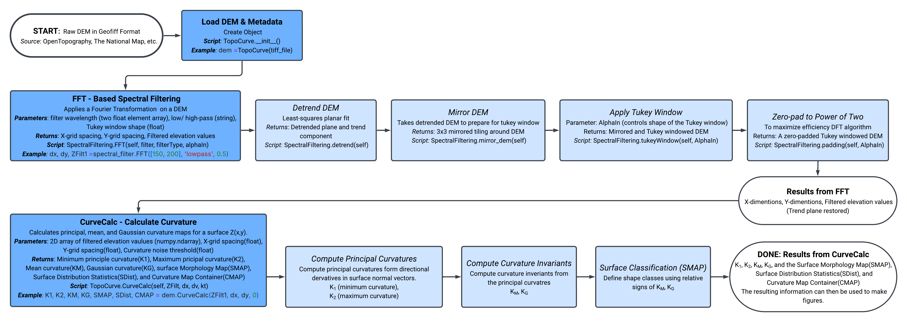

# Summary

The calculation of topographic geometry metrics from Digital Elevation
Models (DEMs) is fundamental to many Earth and planetary process
studies. In particular, slope and curvature of topographic surfaces are
linked to mass transport rates through analytical models, and thus are
primary variables in studies that link topographic form to erosion rate
variation. Making such studies directly comparable across the range of
Earth and planetary settings requires the development data processing
tools and workflows that minimize systematic error, and
self-consistently calculate such metrics on surfaces of any orientation.
*TopoCurve* is a Python package designed to analyze DEMs through a
discrete differential geometry approach that minimizes projection error
through calculation of the full curvature tensor at each pixel in a DEM.
Through the calculation of invariant Mean and Gaussian curvatures this
approach can be used to classify pixels into 9-distinct shape classes,
providing a detailed picture of topographic geometry with potential
applications in geomorphology, geomatics, geography, and adjacent Earth
science fields.

# Statement of Need

As both the resolution and availability of digital elevation datasets
increases, so does their utility in identifying surface process
signatures and their variation in both time and space (Roering et al.
2013). While the connection between slope, curvature, and process models
are well motivated by theory (Fernandes and Dietrich 1997) common DEM
processing workflows introduce systematic slope and curvature-dependent
error that results from projecting topography onto a 2-D map plane
(Minár et al. 2020; Klema et al. 2025), impacting the accuracy and
utility of these connections. The workflow implemented in ‘TopoCurve‘
avoids some of this error through a formal surface-theory approach based
on foundational ideas of Carl Frederick Gauss (Gauss 1902), which itself
laid the groundwork for modern differential geometry and manifold theory
(Pesic 2007). The approach taken here follows that of Klema et al.
(2025), which provides a detailed implementation example.

# State of the Field

Several open‐source Python libraries implement differential‐geometry and
surface analysis tools, but most are designed for triangle meshes or
point clouds rather than gridded elevation models. Packages such as
‘LaPy’ provide FEM‐based Laplace–Beltrami operators and curvature flows
for mesh surfaces (Deep-MI 2023), while geometry‐processing libraries
including ‘trimesh’ and ‘PyMesh’ offer curvature estimators, normals,
and distance operators for 3D meshes
(Dawson-Haggerty et al. 2019; Zhou 2018).
Point‐cloud toolkits such as ‘Open3D’ and ‘PyTorch3D’ supply additional
intrinsic operators and geodesic utilities (Zhou et al. 2018;
Ravi et al. 2020). Although these libraries
demonstrate broad interest in differential geometry within Python
ecosystems, they are primarily designed for meshes rather than raster
data.

For geospatial applications, packages like ‘richdem’, ‘whitebox’, and
‘PyDEM’ compute slope, aspect, and finite‐difference curvature on DEMs,
but these approaches typically rely on planar finite-difference
approximations that can introduce orientation and projection errors at
high relief or resolution (Barnes 2016; Lindsay 2013;
Balut et al. 2020).

*TopoCurve* addresses this gap by adapting discrete differential‐geometry
methods to DEM rasters, enabling reproducible, orientation‐independent
calculations of mean and Gaussian curvature and associated shape
classifications on topographic surfaces.

# Methods

*TopoCurve* provides a comprehensive set of tools for both filtering DEM
datasets and calculating intrinsic curvature invariants of topographic
surfaces. The complete workflow for filtering and computing curvature
invariants on a raw DEM can be seen in Figure
<a href="#fig:Flowchart" data-reference-type="ref"
data-reference="fig:Flowchart">1</a>. Our approach to filtering is
adapted from standard Fourier-based signal processing (Perron et al.
2008). This workflow is well-suited for applications in which it is a
priority not to suppress amplitude components within the region of
interest (Mcnutt 1983; Klema et al. 2025). Amplitude spectra are
filtered using a half-Gaussian filter in the spectral domain. The
spectrum is then inverse-transformed, and the window gives the original
extent of the DEM. This functionality is encapsulated in the ‘Spectral
Filtering’ object class, which allows the user to input wavenumber
cutoffs for the filter and thus filter topography to a desired
wavelength to isolate landscape features at a desired scale. The effects
of low-pass filtering topography using this approach can be seen in
Figure <a href="#fig:specfilt" data-reference-type="ref"
data-reference="fig:specfilt">2</a>, in which a sample DEM taken from
the region of Purgatory Ski Area north of Durango, CO, is filtered to
$200$ meters with half-Gaussian filter that begins at 150 m.

Once topography has been filtered to a desired wavelength, the Mean and
Gaussian curvatures are calculated using the ‘CurveCalc’ function within
the *TopoCurve* object class. Many modern differential geometry
approaches compute these surface curvature invariants through definition
of the ‘Shape Operator matrix’ (O’Neill 2006; Mynatt et al. 2007).
However, the same results with significantly shorter computation times
are found using principal curvatures derived from quadratic equations
that record how curvature varies with orientation at a given point. A
full summary of our mathematical approach can be found in (Klema et al.
2025). The principal curvatures can then be used on their own or be
combined to find the Mean and Gaussian curvatures, defined respectively
as the average and product of the two principal curvatures (Bergbauer
and Pollard 2003). Maps of the mean and Gaussian curvatures can be seen
in Figure <a href="#fig:shapeclasses" data-reference-type="ref"
data-reference="fig:shapeclasses">3</a>.A and Figure
<a href="#fig:shapeclasses" data-reference-type="ref"
data-reference="fig:shapeclasses">3</a>.B respectively.\
The Mean and Gaussian curvatures can be used together to sort each DEM
pixel into one of the shape classes shown in Figure
<a href="#fig:shapeclasses" data-reference-type="ref"
data-reference="fig:shapeclasses">3</a>.C, providing a geometric
representation of surface geometry. The colored shapes come directly
from raw curvature measurements while the generation of points with zero
Gaussian curvature requires definition of a threshold below which
curvatures are taken to be zero (Mynatt et al. 2007). While our code has
the functionality for such thresholding we plot raw curvature values in
our included figures. Defining perfect saddles similarly requires
defining a difference threshold below which Mean curvatures are taken to
be the same. The map view distribution of shape classes for our example
DEM can be seen in Figure
<a href="#fig:shapeclasses" data-reference-type="ref"
data-reference="fig:shapeclasses">3</a>.D. In this example we have not
assigned a curvature threshold and so there are no pixels with zero
Gaussian curvature.

# Example Cases

The *TopoCurve* repository includes three Jupyter notebooks with example
implementations of the code. The notebook ’$`example\_sphere.ipynb`$’
calculates curvature invariants on a sphere of radius $R$, where the
Mean curvature everywhere is $1/R$ and the Gaussian curvature is
$1/R^2$. This example serves to demonstrate the ability of our method
to accurately define curvature across a range of slopes relative to a
horizontal plane. ‘$`example.ipynb`$’ shows a basic topographic analysis
workflow, and demonstrates how the *TopoCurve* package can be used to
recreate Figures <a href="#fig:specfilt" data-reference-type="ref"
data-reference="fig:specfilt">2</a> and
<a href="#fig:shapeclasses" data-reference-type="ref"
data-reference="fig:shapeclasses">3</a> from this report. The notebook
’$`Area\_Binning.py`$ follows the workflow of Klema et al. (2025) and
can be used to recreate their Figure 7.

# Figures

<figure id="fig:Flowchart" data-latex-placement="H">

<figcaption>DEM processing workflow.</figcaption>
</figure>

<figure id="fig:specfilt" data-latex-placement="H">
<embed src="Figures/Figure2.pdf" style="width:90.0%" />
<figcaption>Example of the low-pass filtering pre-processing step
applied to a 10 m resolution DEM taken of Purgatory ski area north of
Durango, CO. <strong>A.</strong> The raw DEM. <strong>B.</strong> DEM
filtered to 200 m wavelengths with a filter that tapers from wavelengths
of 150 m, and which is applied to a mirrored DEM Klema et al.
(2025).</figcaption>
</figure>

<figure id="fig:shapeclasses" data-latex-placement="H">
<embed src="Figures/Figure3.pdf" style="width:90.0%" />
<figcaption> Curvature invariants and surface shape classes calculated
on the filtered DEM from Figure <a href="#fig:specfilt"
data-reference-type="ref" data-reference="fig:specfilt">2</a>.
<strong>A.</strong> First principal curvature. <strong>B.</strong>
Second principal curvature. <strong>C.</strong> Shape classes derivable
from Mean and Gaussian curvatures at each individual DEM pixel. Figure
from Klema et
al. (2025), however it is a modification of similar figures in
Bergbauer and
Pollard (2003) and Mynatt et al. (2007).
<strong>D.</strong> Mean curvature. <strong>E.</strong> Gaussian
curvature. <strong>F.</strong> Map of surface shape
classes.</figcaption>
</figure>

Balut, Adrian et al. 2020. “PyDEM: A Python
Package for Digital Elevation Model Analysis.” *Journal of Open Source
Software*.

Barnes, Richard. 2016. “RichDEM: Terrain Analysis Software.” *Computers
& Geosciences*, ahead of print.
<https://doi.org/10.1016/j.cageo.2016.08.006>.

Bergbauer, Stephan, and David D. Pollard. 2003. “How to Calculate Normal
Curvatures of Sampled Geological Surfaces.” *Journal of Structural
Geology* 25 (2): 277–89.
<https://doi.org/10.1016/s0191-8141(02)00019-6>.

Dawson-Haggerty, M. et al. 2019. *Trimesh: A
Python Library for Loading and Using Triangular Meshes*.
<a href="https://github.com/mikedh/trimesh"
class="uri">Https://github.com/mikedh/trimesh</a>.

Deep-MI. 2023. *LaPy: A Python Library for Differential Geometry on
Meshes*. <a href="https://github.com/Deep-MI/LaPy"
class="uri">Https://github.com/Deep-MI/LaPy</a>.

Fernandes, Nelson F., and William E. Dietrich. 1997. “Hillslope
Evolution by Diffusive Processes: The Timescale for Equilibrium
Adjustments.” *Water Resources Research* 33 (6): 1307–18.
<https://doi.org/10.1029/97wr00534>.

Gauss, Carl F. 1902. “General Investigations of Curved Surfaces of 1827
and 1825.” *Nature* 66: 316–17. <https://doi.org/10.1038/066316b0>.

Klema, Nathaniel, Leif Karlstrom, and Joshua Roering. 2025. “Discrete
Differential Geometry of Fluvial Landscapes.” *EGUsphere* 2025: 1–42.
<https://doi.org/10.5194/egusphere-2025-4431>.

Lindsay, J. B. 2013. *WhiteboxTools: Open-Source Geospatial Analysis
Software*. <a href="https://github.com/opengeospatial/whitebox-tools"
class="uri">Https://github.com/opengeospatial/whitebox-tools</a>.

Mcnutt, Marcia. 1983. “Influence of Plate Subduction on Isostatic
Compensation in Northern California.” *Tectonics* 4 (2): 399–415.

Minár, Jozef, Ian S. Evans, and Marián Jenčo. 2020. “A Comprehensive
System of Definitions of Land Surface (Topographic) Curvatures, with
Implications for Their Application in Geoscience Modelling and
Prediction.” *Earth-Science Reviews* 211: 103414.
<https://doi.org/10.1016/j.earscirev.2020.103414>.

Mynatt, Ian, Stephan Bergbauer, and David D. Pollard. 2007. “Using
Differential Geometry to Describe 3-d Folds.” *Journal of Structural
Geology* 29 (7): 1256–66. <https://doi.org/10.1016/j.jsg.2007.02.006>.

O’Neill, Barrett. 2006. “Elementary Differential Geometry.” *Elementary
Differential Geometry*.

Perron, J. Taylor, James W. Kirchner, and William E. Dietrich. 2008.
“Spectral Signatures of Characteristic Spatial Scales and Nonfractal
Structure in Landscapes.” *Journal of Geophysical Research: Earth
Surface* 113 (F4). <https://doi.org/10.1029/2007jf000866>.

Pesic, Peter. 2007. *Beyond Geometry: Classic Papers from Riemann to
Einstein*. Courier Corporation.

Ravi, N., J. Reizenstein, et al. 2020.
“PyTorch3D: An Efficient Library for Deep Learning on 3D Data.” *CVPR*.

Roering, Joshua J., Benjamin H. Mackey, Jill A. Marshall, et al. 2013.
“‘You Are HERE’: Connecting the Dots with Airborne Lidar for Geomorphic
Fieldwork.” *Geomorphology* 200: 172–83.
<https://doi.org/10.1016/j.geomorph.2013.04.009>.

Zhou, Qian-Yi, Jaesik Park, and Vladlen Koltun. 2018. “Open3D: A Modern
Library for 3D Data Processing.” *arXiv:1801.09847*.

Zhou, Qingnan. 2018. *PyMesh: Geometry Processing Library for Python*.
<a href="https://github.com/PyMesh/PyMesh"
class="uri">Https://github.com/PyMesh/PyMesh</a>.

